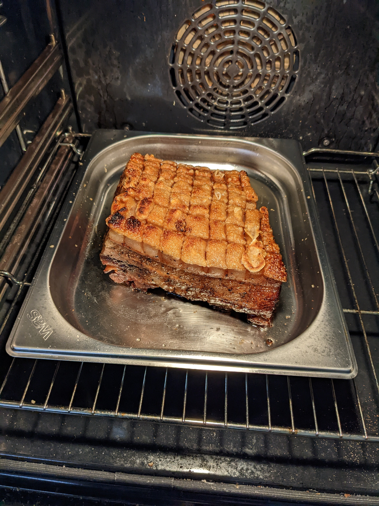
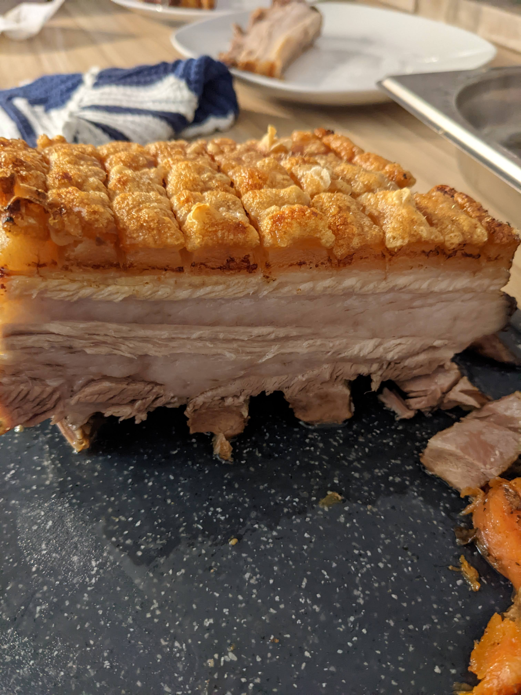
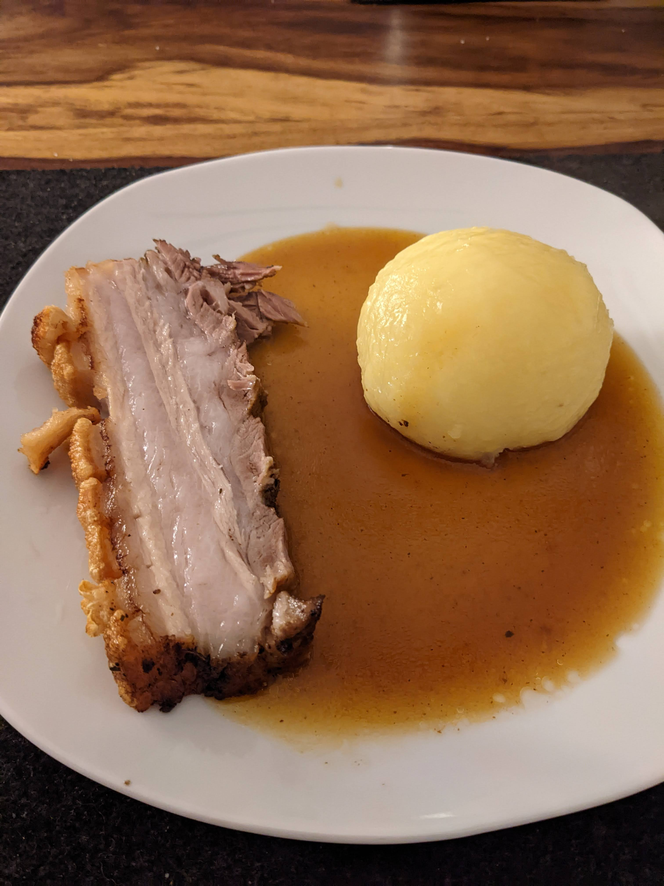

Bierbratl
=========

Es gibt nicht viel schöneres als eine saftige Scheibe Schweinebauch mit einer
süßlich-röstigen Sauce, einem Kartoffelknödel und etwas bayerisch Kraut dazu -
Natürlich begleitet von einer Halben Bier.

Basis für das "Bierbratl" ist ein Wammerl (bayerisch) - also ein schönes Stück
Schweinebauch. Wie so oft, kommt es auch hier auf die Fleischqualität
an - es sollte schön von Fett durchzogen sein.

Zutaten
-------

* 2 Kg Schweinebauch (roh)
* 6 Möhren
* 1/2 Sellerieknolle
* 1 Lauch
* 2 Zwiebeln
* 2 Zehen Knoblauch
* 1 Flasche dunkler Doppelbock, Malzbier oder vergleichbares (wichtig: Hohe
  Restsüße, wenig herb)
* 800ml Gemüsebrühe
* 1 würfelgroßes Stück Ingwer
* 1 EL Tomatenmark
* 1 TL Majoran 
* 1 TL Kümmel (ganz)
* 1 TL Kümmel (gemahlen)
* 1 EL Puderzucker
* 1/2 TL Beifuß
* 1/2 TL Piment
* 1 Lorbeerblatt
* Salz
* Pfeffer
* Butterschmalz

Arbeitsschritte
---------------

Den Schweinebauch rundherum mit Salz einreiben und für 1 Stunde
dämpfen - idealerweise im Dampfgarer bei 100 Grad. Den enstehenden Bratsaft
auffangen.

In der Zwischenzeit das Gemüse putzen und klein schneiden - dabei Zwiebeln und
Lauch separat halten.
Den gemahlenen Kümmel, Majoran, Beifuß, Piement, 1 TL Salz und ordentlich
Pfeffer vermischen. Den Ofen auf 150 Grad Ober-/Unterhitze vorheizen.

Wenn der Braten fertig gedämpft ist, diesen rundherum (die Schwarte
auslassen) mit der Gewürzmischung einreiben, die Schwarte entweder längs oder
rautenförmig einschneiden und 2 TL Salz auf der Schwarte verteilen und
einreiben.

In einem großen Bräter nun das Butterschmalz auslassen, den Braten mit der
Schwarte nach oben reinlegen und scharf anbraten. Ist er auf der Unterseite
gut gebräunt, heraus nehmen und Möhren sowie Sellerie im Bräter scharf anbraten
und anbräunen lassen. Zwiebeln, Lauch, den ganzen Kümmel und eine angestossene
Knoblauchzehe zugeben und ebenfalls anbräunen lassen.
Tomatenmark zugeben, unterrühren und mit anbraten. Das Gemüse mit 400 ml
Brühe ablöschen und 200ml Bier sowie den aufgefangenen Bratensaft zugeben. Den
Schweinebauch wieder mit der Schwarte nach oben in den Bräter legen und diesen
für 150 Minuten bei 150 Grad ohne Deckel im Ofen braten.

1 TL Salz mit etwas warmen Wasser verrühren, so dass sich gerade das ganze
Salz im Wasser löst. Zweimal während der Bratzeit (z.b. jede volle Stunde) die
Salzlösung auf die Schwarte aufpinseln.

Ist die Zeit abgelaufen, den Schweinbauch aus den Bräter nehmen, den Sud
durch ein Sieb schütten und beiseite stellen. Nun den Braten zurück in den
Bräter legen und bei Oberhitze/Grillstufe im Ofen weiterbraten - Ziel ist es
nun, die Schwarte zum aufploppen zu bringen. Ist die Schwarte aufgeploppt, den
Ofen ausschalten und die Tür kurz offen halten damit die Wärme entweichen
kann - der Braten kann jetzt für den Rest der Zubereitungszeit im Ofen
verbleiben (ggf. nochmals lüften - bei der Grillstufe besteht die Gefahr, dass
die Kruste verbrennt).

In einem Topf den Puderzucker karamellisieren lassen. Ist der Karamell
bernsteinfarben, ihn mit der restlichen Gemüsebrühe ablöschen (Vorsicht,
heiß!), 200ml Bier zugeben und den Karamell auflösen lassen. Ingwer, die
zweite angestossene Knoblauchzehe und das Lorbeerblatt zugeben, ebenso den
Bratensud und aufkochen lassen - 10 Minuten simmernd einreduzieren lassen. 

Die Sauce durch ein Sieb geben und wieder in den Topf zurück schütten - mit
Salz und Pfeffer abschmecken und mit Stärke binden, bis die gewünschte
Konsistenz erreicht ist.

Der restliche Doppelbock darf jetzt vom Koch als Belohnung getrunken werden.

Fotos
-----

